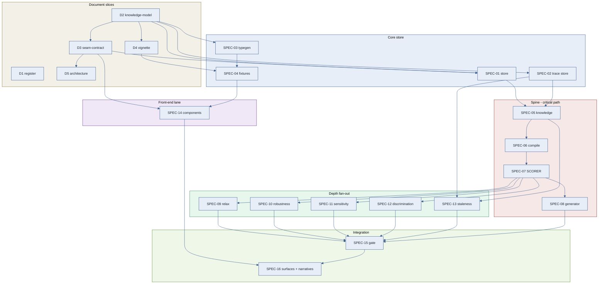

# ASSAY — Delivery Plan & Specification Slicing

Status: draft for review · v0.1 · 2026-07-11 · candidate addition to the canonical set
Authority: ASSAY-DEC-4 (mock behind seam), DEC-5 (spine architecture, trace graph first-class), DEC-7 (theses as configurations), DEC-10 (scorer as an independently callable unit), DEC-11 (research-first stages). Sequencing authority remains `assay-build-plan.md`; methodology remains the register (DEC-2).
Companions: `assay-build-plan.md` (stage sequencing), `assay-concept.md` (§4 canonical set, §6 open questions), `assay-ui-design.md` (surfaces & components).

This document does not introduce methodology or re-sequence the build plan. It **translates** the build plan's seven stages into spec-kit-shaped specifications, overlays the dependency graph that the stage-linear narrative leaves implicit, and names where genuine parallel working is available. Where a slice would originate a new decision, that is a register conversation, not a licence carried here.

---

## 1. How we deliver

Three facts about the existing documents set the shape of delivery:

1. **Four canonical documents are declared but not authored** (`assay-concept.md` §4): `assay-register.md`, `assay-knowledge-model.md`, `assay-seam-contract.md`, `assay-vignette.md` (and `assay-architecture.md`, seeded by §3). The schema, the contract, and the vignette are *hard prerequisites* to nearly every build slice — the type-gen pipeline, the store's object shapes, the fixtures, and every service signature all reference them. Delivery therefore opens with a bounded document workstream, not with code.

2. **The scorer is the delivery linchpin** (DEC-10, and the build plan's own scorer-before-generator rationale). Theses C/D/E/F are re-scoring loops plus trace walks; they consume the scorer and almost nothing else. So the critical path runs *through* the scorer, the depth stages (4–6) **fan out in parallel** behind it, and the handful **generator is sacrificial scope** — a canned handful over an honest scorer still demonstrates four theses.

3. **The front end is a separable lane.** Surfaces only *arrange* projections (DEC-5); the shared component library depends only on the seam contract's *types*, not on any compute behind it. The band pill and provenance chip — the demonstrator's signature elements and "the thing SMEs will test first" — can be built and reviewed against fixture data while the services are still being written.

The delivery is therefore **five documents, then a spine driven on the critical path, with three lanes running alongside it**: core store, front-end components, and (once the scorer stands) the depth fan-out. The spine-complete gate (build plan §"gate") is the one true barrier before narrative polish.

Every build specification inherits the DEC-11 rule verbatim: **its research note must exist in `docs/research/` before its implementation starts.** Research notes are themselves a parallelisable pre-work lane (§4, Lane R) — bounded hours each, independent of one another, each preceding only its own slice's code.

## 2. The specification series

Two kinds of slice. **Document slices (D#)** author the missing canonical set and are register/design work, not spec-kit features. **Build specifications (SPEC-##)** are spec-kit features (`specs/NNN-name/` → spec → plan → tasks), each an independently testable slice with the build plan's exit criteria as its acceptance scenarios.

### 2.1 Document slices

| ID | Document | Unblocks | Depends on |
|---|---|---|---|
| **D1** | `assay-register.md` — split from concept §2; DEC numbering; register-first from here on | register-first discipline for every later decision | — |
| **D2** | `assay-knowledge-model.md` — LinkML schema (KnowledgeObject, Commitment, ScenarioCOA, CompiledWorld, Plan, Rationale, TraceEdge), founding doc 2 | typegen, store shapes, contract, fixtures | — |
| **D3** | `assay-seam-contract.md` — REST shapes/semantics: `/knowledge`, `/compile`, `/score`, `/plan/handful`, `/relax`, `/analyse/*`, `/trace/*`, `/deltas`; refusal paths; stamp semantics | every service + the component library | D2 |
| **D4** | `assay-vignette.md` — Meridian: knowledge K1–K14, red COAs, commitment set, engineered to exercise B/C/D/E/F | fixtures, every exit criterion | D2 |
| **D5** | `assay-architecture.md` — services, surfaces, trace graph, invariants G2–G5 | gate harness, surface bundles | D3 |

D2 is upstream of D3, D4, D5. **D1 and D2 can start immediately and in parallel; D3 and D4 then run in parallel behind D2; D5 follows D3.**

> **Status (2026-07-11, batch 2):** D1–D4 authored; D5 deferred by ASSAY-DEC-13, with invariants G1–G5 carried normatively in `assay-seam-contract.md` §G in the interim. §1's "declared but not authored" described the state at this plan's drafting.

### 2.2 Build specifications

Stage column maps to `assay-build-plan.md`. Research note is the DEC-11 prerequisite named there.

| ID | Specification | Stage | Depends on | Research note |
|---|---|---|---|---|
| **SPEC-01** | Content-addressed store — canonical JSON, content hashing, `PUT/GET/exists/versions` | 0 | D2, D3 | `00-foundations.md` |
| **SPEC-02** | Trace-graph store — TraceEdge, forward/backward walks | 0 | D2, D3 | `00-foundations.md` |
| **SPEC-03** | LinkML → TypeScript type-generation pipeline | 0 | D2 | `00-foundations.md` |
| **SPEC-04** | Vignette fixtures — K1–K14, COAs, commitments, validated against generated types | 0 | D4, SPEC-03 | — |
| **SPEC-05** | Knowledge service + encoding discipline (waiver, encoding_violation, scenario_weight firewall); band pill/provenance chip wired to a minimal S1 table | 1 | SPEC-01, SPEC-02, D3 | `01-knowledge.md` |
| **SPEC-06** | Compile service → CompiledWorld channels; deterministic stamp; `compiled_into` edges; refusal paths | 2 | SPEC-05 | `02-compile.md` |
| **SPEC-07** | **Scorer unit** — plan × world × scenario → CommitmentVerdicts + banded scores; `knowledge_overrides` perturbation hook. Acceptance includes the vignette §9 oracle cases (O-1–O-3 reproduced exactly) and property-based tests for the O-4 propagation-honesty property (candidate G6) — the scorer's *correctness* leg, independent of the engineered demo exits | 3 | SPEC-06 | `03-score-plan.md` |
| **SPEC-08** | Handful generator + banded non-dominated organisation (*sacrificial scope*) | 3 | SPEC-07 | `03-score-plan.md` |
| **SPEC-09** | Relaxation / least-worst — `/relax`, `sacrificed` populated (invariant G4) | 4 | SPEC-07 | `04-relaxation.md` |
| **SPEC-10** | Scenario robustness — multi-scenario scoring, dominance across banded scenario scores, comparability guard | 5 | SPEC-07 | `05-robustness.md` |
| **SPEC-11** | Analysis · sensitivity — band-edge perturbation loop; single-source flag | 6 | SPEC-07, SPEC-02 | `06-analysis.md` |
| **SPEC-12** | Analysis · discrimination — COA-pair separation over open questions | 6 | SPEC-07 | `06-analysis.md` |
| **SPEC-13** | Analysis · staleness — transitive trace walk | 6 | SPEC-02, SPEC-05 | `06-analysis.md` |
| **SPEC-14** | Shared component library — band pill, provenance chip, verdict chip, trace drawer, stamp badge, delta row, scenario strip, refusal banner — delivered as a **fixture-backed gallery**: every component rendered over real Meridian fixture objects (content-addressed instances, not mock props), reviewable from Wave 0 and embeddable on the comms Demo page. The first user-visible value the build produces, and honest by construction — projection of real data, no compute faked. **Extractability constraint**: components depend only on the generated LinkML types, never on app state or services — the comms plan §8 standalone-embed target already requires per-component bundling, and this one rule keeps the library extractable as a standalone honest-uncertainty UI kit (a durable asset beyond ASSAY, REMIT included) at zero extra cost | (cross-cut) | D3, SPEC-04 | — |
| **SPEC-15** | Spine-complete gate harness — asserts content-addressing, stamp determinism, and invariants G2–G5 end-to-end on Meridian; re-asserts the vignette §9 oracle cases and the O-4 propagation-honesty property (candidate G6) | gate | SPEC-05…13 | — |
| **SPEC-16** | Surfaces S1–S4 as config-declared bundles + five narrative scripts + banded-honesty polish pass | 7 | SPEC-14, SPEC-15, services | `07-narratives.md` |

> **Status (2026-07-13, spine through Stage 3 + first depth slice):** SPEC-01…04 (Stage 0), SPEC-05/06/07/08 (Stages 1–3), and SPEC-09 (Stage 4) built and merged/branch-open. The spine `δ` (SPEC-05 → SPEC-06 → SPEC-07 → SPEC-08) is complete: the scorer stands and the honest generator organises a computed handful over it. SPEC-08's *sacrificial-scope* latitude was spent — the canned fallback (`fixtures/plans.json`) is retained for the SPEC-07 suite; the gallery's honest matrix now runs the generated handful. The depth fan-out `ε` has opened: **SPEC-09 (relaxation / least-worst, thesis B) is built** over research note `04-relaxation.md` — `/relax` returns the inclusion-minimal least-worst frontier (three candidates sacrificing C4/C3/C2 on R3m), ranked by ordinal tier with a stated tie-break, `sacrificed` computed by the reused scorer, never empty and never a silent drop (G4); the "least-worst, never silence" demo moment renders in the gallery. The front-end lane `γ` has produced its first **interactive** surface: **SPEC-16 (interactive surfaces) is built** over research note `05-surfaces.md` (DEC-11 gate; concept §6 candidates 14–16, flagged) — the published app is now a live single-page app running the *real* pipeline in the browser (esbuild bundle, `npm run build:app`, published at `assets/app/`): four role tabs over one client store, full editability gated by the existing honesty machinery (dishonest edits refuse, G2/G5), a hash-derived "glow" that renders propagation honesty (G6) as an operator-visible affordance, and a one-hop "informs / influenced by" trace menu over a per-edge-type orientation map (`src/traceView.ts`). The components stayed pure (the shell/pure-component split preserves SPEC-14 extractability). Shipped with its comms §6 article (`docs/blog/`), which embeds the live demonstrator. **Next: the rest of the depth fan-out `ε` (SPEC-10 scenario robustness ∥ SPEC-11/12/13 analysis) opens on the landed scorer + relax; the focused transitive dependency-graph view is tracked as a horizon issue.**

## 3. Dependency graph & critical path

**Critical path:** `D2 → D3 → SPEC-05 → SPEC-06 → SPEC-07 → SPEC-15 → SPEC-16`. Every schedule risk lands on the scorer (SPEC-07); protecting its research note (`03-score-plan.md`) and its input from a clean compile stamp is the delivery's chief concern.

**Float (off critical path):** SPEC-01/02/03 finish well ahead of SPEC-05 and can absorb slip. SPEC-08 (generator) can slip to the gate or beyond — a canned handful over the real scorer keeps SPEC-11/12/13 demonstrable (the build plan's explicit fallback). SPEC-14 has the whole build's duration of slack as long as it lands before SPEC-16.

## 4. Parallel-working plan

Six swimlanes. Barriers are marked; everything else inside a lane is pipelined.

| Lane | Slices | Runs against |
|---|---|---|
| **α · Docs** | D1 ∥ (D2 → {D3 ∥ D4} → D5) | starts at t0; D1 and D2 immediately concurrent |
| **β · Core store** | SPEC-01 ∥ SPEC-02; SPEC-03 → SPEC-04 | starts once D2 (and D3 for the store) land |
| **γ · Front-end** | SPEC-14 | starts once D3 lands (component contracts from types; fixture objects flow in as SPEC-04 lands); runs the entire build alongside every backend lane; its gallery is the build's first user-visible value |
| **δ · Spine** | SPEC-05 → SPEC-06 → SPEC-07 (→ SPEC-08) | the critical path; single-threaded by dependency |
| **ε · Depth fan-out** | SPEC-09 ∥ SPEC-10 ∥ SPEC-11 ∥ SPEC-12 ∥ SPEC-13 | **all five open the moment SPEC-07 lands** — the widest parallel window |
| **ζ · Integration** | SPEC-15 → SPEC-16 | SPEC-15 is the spine-complete **barrier**; SPEC-16 is post-gate |
| **R · Research notes** | `00`…`07` DEC-11 notes | each precedes only its own slice; author ahead of need |

**Where parallelism is genuine:**
- **Front-end (γ) vs. services (δ/ε)** — the largest independent lane. Components consume contract types + fixtures, never live compute.
- **The depth fan-out (ε)** — SPEC-09/10/11/12/13 share only the scorer and the trace store, both read-only to them; with 3–4 workers this collapses stages 4–6 from sequential to a single wave. The three analysis slices (11/12/13) are the purest example — DEC-10 makes each a thin orchestration of the same scorer.
- **Store vs. trace store (SPEC-01 ∥ SPEC-02)** and **seam-contract vs. vignette (D3 ∥ D4)** — independent once their shared upstream (D2) exists.
- **Research notes (R)** — fully parallel; the discipline that gates code need not gate reading.

**Where parallelism is false — do not attempt:**
- **Generator ahead of scorer.** SPEC-08 before SPEC-07 inverts DEC-10 and the honesty invariant (DEC-4); a generator with no honest scorer to organise against is theatre.
- **Any slice's code ahead of its research note (DEC-11).** The note is the barrier; skipping it to "parallelise" is precisely the failure DEC-11 exists to prevent (build plan §risks: inventing a confidence mapping instead of doing the ICD 203 work).
- **Surfaces before the gate.** SPEC-16 chrome over an un-gated spine hides broken trace chains rather than surfacing them (DEC-5; the "dead-end = visible error" rule).

**Suggested wave structure (barriers between waves):**

| Wave | In flight | Gate to exit |
|---|---|---|
| 0 | D1, D2, D3, D4, D5 · SPEC-01/02/03/04 · start SPEC-14 | fixtures validate against generated types; store round-trips with stable hash; trace walks both ways; gallery renders band pill + provenance chip over fixture objects (first user-visible value) |
| 1 | SPEC-05, SPEC-06 | K10 refused, K8 waiver visible, contested K12 blocks compile; same knowledge ⇒ byte-identical stamp |
| 2 | SPEC-07 (+ SPEC-08 opportunistic) | handful of 3–5 distinct plans; same stamp+seed ⇒ identical handful; every verdict opens a full trace chain |
| 3 | SPEC-09/10/11/12/13 fan-out · continue SPEC-14 | each depth exit criterion (R3 sacrifices, R1 collapse under R2, K8 tops sensitivity, K11 > K13 discrimination, K9 supersession flags exactly K5-dependent verdicts) |
| gate | SPEC-15 | invariants G2–G5 + content-addressing + stamp determinism hold end-to-end on Meridian; theses A–F walkable |
| 4 | SPEC-16 | each narrative runs as a scripted 10-minute demo from cold start, offline |

## 5. Open questions that gate slicing

These are `assay-concept.md` §6 / `assay-ui-design.md` §6 items that change a slice's shape and want a register answer before that slice starts (not before the whole build):

1. **Surface shell — tabs in one SPA vs. routed micro-frontends** (concept §6.4, ui §6.2). Gates **SPEC-16**, not the services; can be answered as late as end of Wave 3.
2. **Handful generation strategy axes for this domain** (concept §6.2 — REMIT's axes do not transfer unexamined). Gates **SPEC-08**; folds into its `03-score-plan.md` research note.
3. **Thesis G honest v1 slice?** (concept §6.3) — explicitly deferred by the build plan; no slice here. Naming it keeps it out of scope by decision, not by omission.
4. **Map/geospatial panel** (ui §6.1) — no narrative requires it in v1; if admitted, it is an additive S2 side-panel spec after SPEC-16, never a spine dependency.

## 6. Next step

With this slicing agreed, each build specification is instantiated with the repo's Spec Kit toolchain — `/speckit.specify` per SPEC-##, seeded from the build plan's stage description (its exit criteria become the spec's acceptance scenarios), then `/speckit.plan` and `/speckit.tasks`. The document slices (D1–D5) proceed as ordinary register/authoring batches. Recommended first instantiations, in dependency order: **D1, D2** (parallel), then **D3, D4**, then **SPEC-01/02/03** and **SPEC-14** opened together.
