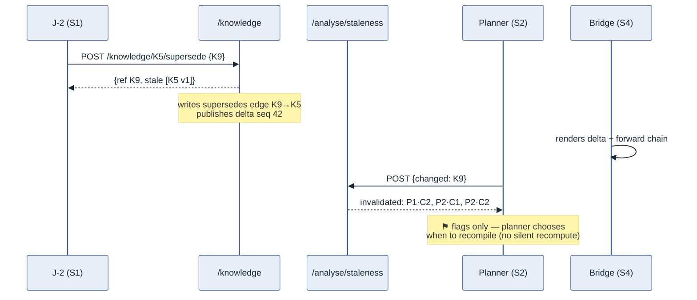
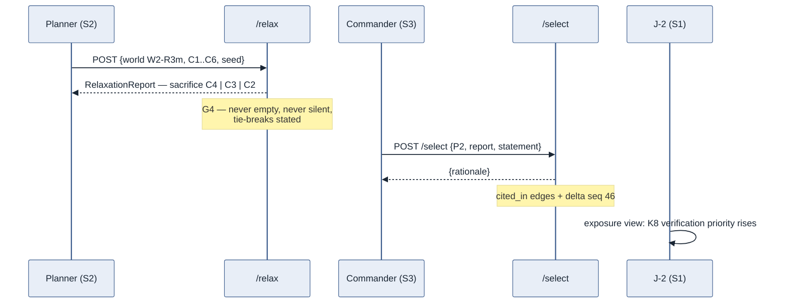

# ASSAY — Walkthrough: One Heartbeat on Meridian

Status: draft for review · v0.1 · 2026-07-11 · candidate addition to the canonical set (concept §6)
Authority: this document **originates nothing**. It elaborates ASSAY-DEC-5 (writes are stamped deltas; trace graph first-class), DEC-9/15 (banded honesty), DEC-17 (scenario clock; lifecycle), DEC-19 (relaxation honesty), DEC-21 (supersession as edge) by playing them end-to-end. Every step names the endpoint, payload shapes, and trace edges defined in `assay-seam-contract.md` and `assay-knowledge-model.md`; every instance is a vignette identifier frozen by `assay-vignette.md` §8.
Companions: `assay-ui-design.md` (which surface renders each step), `assay-ui-wireframes.html` (the tableau frozen between beats 1 and 2 below).

**Discipline rule (normative for this document's upkeep):** if a step described here cannot be performed with the seam contract as written, the *contract* is the defect, not the walkthrough — the gap is fixed in the contract and logged in §9. This document is the standing end-to-end validation of the interaction, data-structure, and data-flow story; it is re-walked whenever the contract or knowledge model changes.

---

## 0. Why this document exists

The value ASSAY demonstrates lives in three things working together: **user interactions** (what each role does), **data structures** (what those actions create), and **data flows** (how one role's act becomes another role's signal). The knowledge model holds the structures, the seam contract holds the movement, and the UI design holds the surfaces — but no single artefact plays them through. This one does: one full turn of the JIPOE-supports-planning loop (`ui-design` §3.2) on Meridian, at the moment the vignette engineers to be most instructive — the arrival of the K9 storm forecast at step 8, with the K12 contest breaking at the same time.

Each beat below records: **who acts, on which surface, calling what, creating which objects and edges, publishing which delta — and what every *other* role sees as a result.**

## 1. Opening state — D+2, scenario step 8

| Live state | Detail |
|---|---|
| Knowledge | K1–K8 `answered` (K8 under waiver W-1); K10 `retired` (refused `encoding_violation` at POST — the Stage-1 exhibit); K11, K13 `open`; K12a/K12b about to be contested; K14a–c scenario weights (never compile — knowledge model §9) |
| World | `W1` · stamp `7f3a…c91` · compiled at step ~7 from the answered set K1–K8 + vignette config; excursion variants for R1/R2/R3 share the stamp lineage; `compiled_into` edges written per consumed object |
| Handful | P1–P4 from `POST /plan/handful {world: W1, seed: 42}` — P1 north-early (R1-optimal), P2 sweep-first, P3 parallel sweep, P4 berths-first; `scored_from` edges per verdict/score |
| Surfaces | S1 queues ranked; S2 matrix green against `7f3a…c91`; S3 idle; S4 feed at delta seq 41 |

## 2. Beat 1 — the J-2 revises knowledge (K9 supersedes K5)

The met service issues an updated forecast: surge 1.1–1.8 m peaking D+5–D+7. The D+0–D+4 forecast (K5, validity steps 0–16) is overtaken.

| | |
|---|---|
| Actor · surface | J-2 · S1 (Refresh & resolve queue) |
| Call | `POST /knowledge/K5/supersede {object: K9}` — cross-lineage supersession (DEC-21; the knowledge model's worked example) |
| Objects created | `K9 v1` (banded answer 1.1–1.8 m · provenance reported/high · validity 8–36), content-addressed at `PUT` |
| Edges written | `supersedes: K9 → K5` — written by the knowledge service at write time, never reconstructed (constitution III) |
| Response | `{ref: K9, stale: [K5 v1]}` — exactly the versions the edge staled |
| Delta | seq 42 · `{actor: J-2, role: J-2, op: supersede, refs: [K9, K5]}` — `at` is display-only envelope (DEC-17) |

**Fan-out (reads, not writes — nothing recomputes silently):**

- **S2** calls `POST /analyse/staleness {changed: K9}` on the delta → `{invalidated: {verdicts: [P1·C2, P2·C1, P2·C2], …}, chains}` — a transitive forward trace walk, returning *exactly* the K5-dependent artefacts and nothing else (thesis F). The matrix shows three ⚑ flags and "recompile when ready". The planner decides when; that decision is the interaction, not an implementation detail.
- **S1** exposure view: K9 now sits under a live handful the moment the planner recompiles.
- **S4** renders the fan-out: K9 —supersedes→ K5 —compiled_into→ tide/storm channels —scored_from→ the three flagged verdicts.

## 3. Beat 2 — contest and resolve (K12)

The allied LNO's pre-war-manifest estimate (K12b: 140–220 mines) cannot be reconciled with the J-2 red cell's defector debrief (K12a: 30–60).

1. **Contest.** J-2 · S1: `POST /knowledge/K12a/contest {object: K12b}` → both objects `contested`, `contests` edge written, delta seq 43. *This is a cross-surface write*: the planner's next compile is now blocked (G5), so it lands a delta like any other.
2. **Blocked compile.** Planner · S2, wanting the K9-fresh world: `POST /compile {…}` → **`Refusal {reason: contested_knowledge, offending: [K12a, K12b], explanation}`**. S2 renders the refusal banner naming the pair, with the side-by-side provenance view one click away. A refusal is an honest outcome, first-class in the demo — not an error toast.
3. **Resolve.** J-2, after adjudication: `POST /knowledge/K12a/resolve {surviving: K12b, note}` → `resolves` edge written; the contest closes `resolved` with K12b the surviving answer (DEC-17 lifecycle); delta seq 44. (Which answer survives is fixture latitude under vignette §8; the walkthrough assumes K12b — the higher band — survives, which keeps the R3m mine threat live for beat 4.)

The interaction to notice: **the contest travels from S1 to S2 as a refusal, and back as a resolution, entirely through typed objects and edges** — no email, no annex, no verbal caveat that evaporates.

## 4. Beat 3 — the planner recompiles and regenerates

| | |
|---|---|
| Actor · surface | Planner · S2 toolbar |
| Calls | `POST /compile {knowledge: selector(answered, unexpired), scenario?, config, engine_version}` → `{world: W2, stamp: 9b2e…44a}`; then `POST /plan/handful {world: W2, seed: 42}` |
| Objects | `W2` consuming K9 (not K5 — stale never compiles silently) and K12b; new PlanScores/CommitmentVerdicts for the refreshed handful |
| Edges | `compiled_into` per consumed object; a `waives` edge from the waiver-carrying K8 to the constraint use W-1 licenses (the waiver renders wherever the constraint bites); `scored_from` per verdict/score |
| Delta | seq 45 — S3's cards refresh against the new stamp; S1's exposure strips update (their assessments now drive a live handful) |

The comparability guard earns its keep here: any artefact still carrying `7f3a…c91` greys out next to `9b2e…44a` work rather than being silently compared (G1; `stamp_mismatch`).

## 5. Beat 4 — least-worst under R3m (thesis B)

Against the R3m excursion (both approaches mined, causeway dropped), no plan satisfies C2–C4 together — by construction (vignette §6).

- Planner · S2: `POST /relax {world: W2-R3m, commitments: [C1…C6], seed}` → a **RelaxationReport, never empty, never a silent drop (G4)**: three candidates sacrificing **C4** (parallel sweep — ANVIL/BROOM inside the arc), **C3** (berths first — fires into the harbourfront), **C2** (sequential sweep — "opens the strait D+9, two days late"), each `sacrificed` non-empty, each narrative in command language, same-tier tie-breaks stated in `tie_break` (DEC-19).
- `cited_in` edges connect the verdicts/scores each candidate rests on to the report.
- **S3** renders the report as the three least-worst cards; every element opens the trace drawer backward to named knowledge with named owners (G3).

## 6. Beat 5 — the commander selects

| | |
|---|---|
| Actor · surface | Commander · S3 |
| Call | `POST /select {plan: P2, relaxation_report, statement, decided_by}` (seam §11 — added in v0.2; a raw `PUT /objects` would store the rationale but write no edges, which is why the endpoint exists) |
| Objects | `SelectionRationale` — the commander's act, recorded, content-addressed |
| Edges | `cited_in`: the relaxation report and the verdicts under the chosen card → the rationale |
| Delta | seq 46 — **S1's verification priorities rise on exactly the knowledge now under a committed decision**: K8 (single-source, waiver-carrying, holding the north approach open) tops the queue not because anyone emailed the J-2, but because the exposure view is a forward walk from a decision that now exists |

## 7. Beat 6 — the loop closes (thesis D)

The selection leaves the operative uncertainty explicit: P2's margin under R2 vs R3m turns on whether the strait is actually mined. On the next S1 refresh, `POST /analyse/discrimination` ranks **K11** (mines loaded at Ledger quay — R1/R2 expected bands disjoint) above **K13** (radio traffic — bands nest), *despite* K11's higher banded cost; value and cost are shown side by side, never collapsed (Stage-6 exit). Tasking KINGFISHER against K11 is a human decision with its own commitment consequence (C6, the extraction deadline) — the system ranks, it does not task. The J-2's collection queue is the new turn's first move, and the heartbeat repeats.

## 8. What one heartbeat demonstrates

| Beat | Interactions surfaced | Structures exercised | Flows proven |
|---|---|---|---|
| 1 supersession | revise-and-flag, "recompile when ready" | KnowledgeObject lifecycle, ValidityWindow, supersedes edge | write → delta → staleness walk → flags (F) |
| 2 contest/resolve | refusal as first-class UI; adjudication | contested status, contests/resolves edges, Refusal | S1 write → S2 refusal → S1 resolve (G5) |
| 3 recompile | stamp choice; comparability guard | CompiledWorld, consumed set, waives edge | compile → delta → S3/S1 refresh (A, G1) |
| 4 relax | least-worst cards in command language | RelaxationReport, ordinal tiers, tie_break | infeasibility → argument, never silence (B, G4) |
| 5 select | the decision as a typed, traceable act | SelectionRationale, cited_in edges | decision → exposure re-prioritisation (E) |
| 6 collect | ranked queue, human tasking | ExpectedAnswer matrix, CollectionOption | open question → discrimination → new PIR (D) |

Every arrow above is walkable in the trace graph, both directions, terminating in named owners (G3). That table — not any single service — is the demonstrator's value claim in one place.

## 9. Contract changes this walkthrough forced (log)

Walking the beats against seam contract v0.1 surfaced four gaps, fixed in v0.2 in the same batch as this document:

1. **No listing endpoint** — S3 could not fetch plan/rationale candidates (`GET /objects?class=` added, seam §2).
2. **No selection service** — the commander's write was a raw `PUT /objects`, so nothing wrote the `cited_in` edges the knowledge model requires of "selection" (`POST /select` added, seam §11).
3. **Delta parameter drift** — `?after=t` (ui-design) vs `?since=seq` (seam §10); harmonised on `since=seq`.
4. **Understated write surface** — "only three writes exist in v1" omitted contest/resolve/create, all cross-surface in effect; the write inventory is now enumerated in ui-design §3.2 and delta publication stated in seam §3.

That the gaps clustered on S3 and on the discipline writes is the review finding that motivated this document: flows that are never walked end-to-end stay unproven exactly where the least-specified role meets the most important act.
